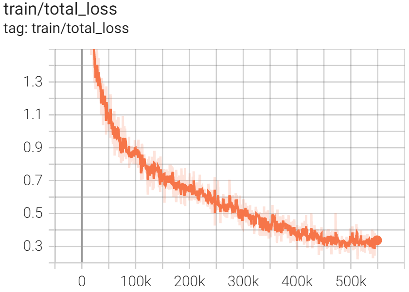
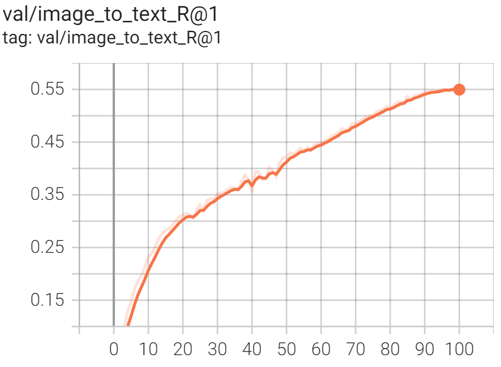
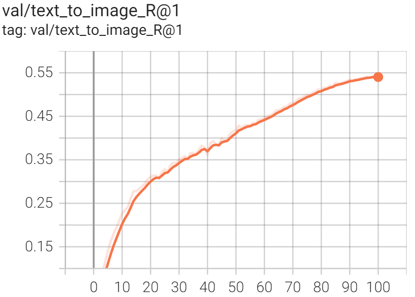

# PMC-CLIP

[](https://colab.research.google.com/drive/1P7uyzK_Mhu1YyMeRrrRY_e3NpkNBOI4L?usp=sharing) 
[](https://huggingface.co/datasets/axiong/pmc_oa)

The dataset and checkpoint is available at [Huggingface](https://huggingface.co/datasets/axiong/pmc-oa), [Baidu Cloud](https://pan.baidu.com/s/1mD51oOYbIOqDJSeiPNaCCg)(key: 3iqf).

📢 We provide the extracted image encoder and text encoder checkpoint in [Huggingface](https://huggingface.co/datasets/axiong/pmc-oa), and a quick start demo on how to use them in encoding image and text input. Check this [notebook](https://colab.research.google.com/drive/1P7uyzK_Mhu1YyMeRrrRY_e3NpkNBOI4L?usp=sharing)!


- [PMC-CLIP](#pmc-clip)
  - [Quick Start Inference](#quick-start-inference)
  - [Train and Evaluation](#train-and-evaluation)
    - [1. Create Environment](#1-create-environment)
    - [2. Prepare Dataset](#2-prepare-dataset)
    - [3. Training](#3-training)
    - [4. Evaluation](#4-evaluation)
  - [Acknowledgement](#acknowledgement)
  - [Contribution](#contribution)
  - [TODO](#todo)
  - [Cite](#cite)

## Quick Start Inference

We offer a quick start demo on how to use the image and text encoder of PMC-CLIP. Check this [notebook](https://colab.research.google.com/drive/1P7uyzK_Mhu1YyMeRrrRY_e3NpkNBOI4L?usp=sharing)!


## Train and Evaluation

Repo Structure
```bash
src/:
    |--setup.py
    |--pmc_clip/
    |   |--loss/
    |   |--model/: PMC-CLIP model and variants
    |   |--model_configs/
    |   |--factory.py: Create model according to configs
    |   |--transform.py: data augmentation
    |--training/
    |   |--main.py
    |   |--scheduler.py: Learning rate scheduler
    |   |--train.py
    |   |--evaluate.py
    |   |--data.py
    |   |--params.py
docs/: project pages
```

### 1. Create Environment

```bash
conda create -n pmc_clip python=3.8
conda activate pmc_clip

pip install -r requirements.txt
# pip install -i https://pypi.tuna.tsinghua.edu.cn/simple -r requirements.txt

python setup.py develop  # install pmc_clip with dev mode
```

### 2. Prepare Dataset

Download from [Huggingface](https://huggingface.co/datasets/axiong/pmc-oa), [Baidu Cloud](https://pan.baidu.com/s/1mD51oOYbIOqDJSeiPNaCCg)(key: 3iqf).
Or follow the [Pipeline of PMC-OA Development](https://github.com/WeixiongLin/Build-PMC-OA) if you want to start from scratch.


### 3. Training

Single GPU
```bash
python -m training.main \
--dataset-type "csv" --csv-separator "," --save-frequency 5 \
--report-to tensorboard \
--train-data="path/to/train.csv" --val-data="path/to/valid.csv" \
--csv-img-key image --csv-caption-key caption \
--warmup 500 --batch-size=8 --lr=1e-4 --wd=0.1 --epochs=100 --workers=8 \
--model RN50_fusion4 --hugging-face --mlm --crop-scale 0.5
```

Multi GPU
```bash
CUDA_VISIBLE_DEVICES=0,1 torchrun --nproc_per_node=2 --rdzv_endpoint=$HOSTE_NODE_ADDR -m training.main \
--dataset-type "csv" --csv-separator "," --save-frequency 5 \
--report-to tensorboard \
--train-data="path/to/train.csv" --val-data="path/to/valid.csv" \
--csv-img-key image --csv-caption-key caption \
--warmup 500 --batch-size=128 --lr=1e-4 --wd=0.1 --epochs=100 --workers=8 \
--model RN50_fusion4 --hugging-face --mlm --crop-scale 0.5
```

<div class="third">
  
  
  
</div>


### 4. Evaluation
Load checkpoint and eval on 2k samples from testset.

```bash
python -m training.main \
--dataset-type "csv" --csv-separator "," --report-to tensorboard \
--val-data="path/to/test.csv" \
--csv-img-key image --csv-caption-key caption \
--batch-size=32 --workers=8 \
--model RN50_fusion4 --hugging-face --mlm --crop-scale 0.1 \
--resume /path/to/checkpoint.pt \
--test-2000
```

Also we provide automatic ways to load model weights from huggingface repo.

| Model | URL |
| --- | --- |
| PMC_CLIP:beta | https://huggingface.co/datasets/axiong/pmc_oa_beta/blob/main/checkpoint.pt |


Take PMC_CLIP:beta checkpoint as an example:
```bash
python -m training.main \
--dataset-type "csv" --csv-separator "," --report-to tensorboard \
--val-data="path/to/test.csv" \
--csv-img-key image --csv-caption-key caption \
--batch-size=32 --workers=8 \
--model RN50_fusion4 --hugging-face --mlm --crop-scale 0.1 \
--resume "PMC_CLIP:beta" \
--test-2000
```


## Acknowledgement
The code is based on [OpenCLIP](https://github.com/mlfoundations/open_clip) and [M3AE](https://github.com/zhjohnchan/M3AE). We thank the authors for their open-sourced code and encourage users to cite their works when applicable.

Note that our code don't supported tools like horovod, wandb in OpenCLIP. But we keep the code from OpenCLIP for consistency.

## Contribution
Please raise an issue if you need help, any contributions are welcomed.

## TODO

* [ ] Compatibility testing on more env settings
* [ ] Support for horovod, wandb


## Cite
```bash
@article{lin2023pmc,
  title={PMC-CLIP: Contrastive Language-Image Pre-training using Biomedical Documents},
  author={Lin, Weixiong and Zhao, Ziheng and Zhang, Xiaoman and Wu, Chaoyi and Zhang, Ya and Wang, Yanfeng and Xie, Weidi},
  journal={arXiv preprint arXiv:2303.07240},
  year={2023}
}
```

The paper has been accepted by MICCAI 2023.
```bash
@inproceedings{lin2023pmc,
  title={Pmc-clip: Contrastive language-image pre-training using biomedical documents},
  author={Lin, Weixiong and Zhao, Ziheng and Zhang, Xiaoman and Wu, Chaoyi and Zhang, Ya and Wang, Yanfeng and Xie, Weidi},
  booktitle={MICCAI},
  year={2023}
}
```

